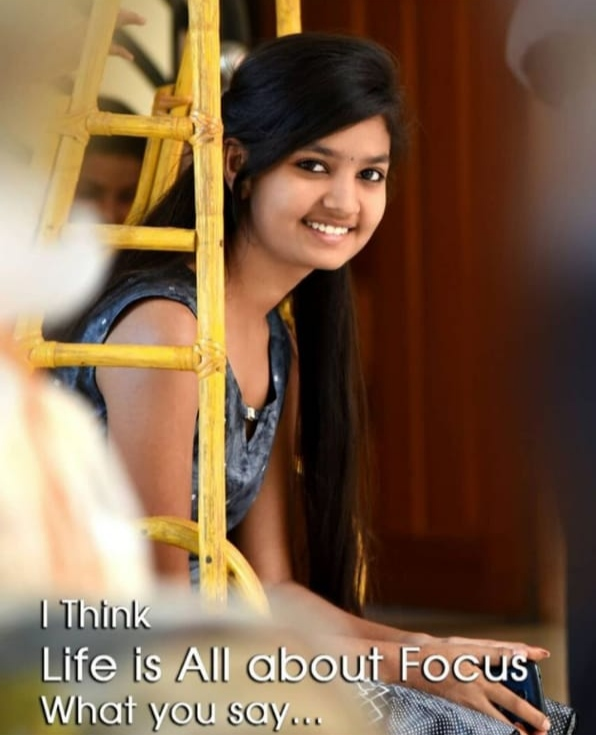

# happy-bday<!DOCTYPE html>

<head>
    Happy Birthday NEHA
</head>

<body>

<audio class="song" controls loop width="100" hight="50">
    <source src="foru.mp4"></source>
    Your browser isn't invited for super fun audio time.
</audio>

    <h2 style="color:#F2B300;">H</h2>

    <h2 style="color:#0719D4;">B</h2>

    <h2 style="color:#D14D39;">D</h2>

    <h2 style="color:#D14D39;"><3</h2>

    <h2 style="color:#8FAD00;">N</h2>

    <h2 style="color:#8377E4;">E</h2>

    <h2 style="color:#99C96A;">H</h2>

    <h2 style="color:#20CFB4;">A</h2>

    <h2 style="color:#20CFB4;"><3</h2>

    
        

                                                    This is for you my <3

    
       
           
        
    
    
        
           
        
    
    
        
           Today is 29/11/2001
            as beautiful as other days
            but you realize
            another year has gone
            in a blink of the eyes
            however
            Do you know..?
            today is just special
            so special to you
            hat's why
            let's make it...
            the best celebration ever
            and let me share...
            a piece of happiness to you
            I made all this...
            as a birthday present to you
            thanks for being there
            thanks for the friendship we made
            thanks for everything
            I wish you all the best
            May your life be at ease
            May all your wishes come true
            Remember
            your ambitions
            you live as a free bird...
            flying in the blue sky
            Now things are different...
            real story of your life
            is just about to begin
            indeed..
            but...
            don't worry
            because...
            God has your back
            and
            this year will be better
            and I hope
            you'll find...
            happiness along the way
            keep your spirit 
            enjoy every single moment...
            that you experience today
            fill it with your most beautiful smile
            and make it the best memory..
            lastly...
            I'd like to wish you one more time
            a very happy birthday Xola Mathembisa
       
